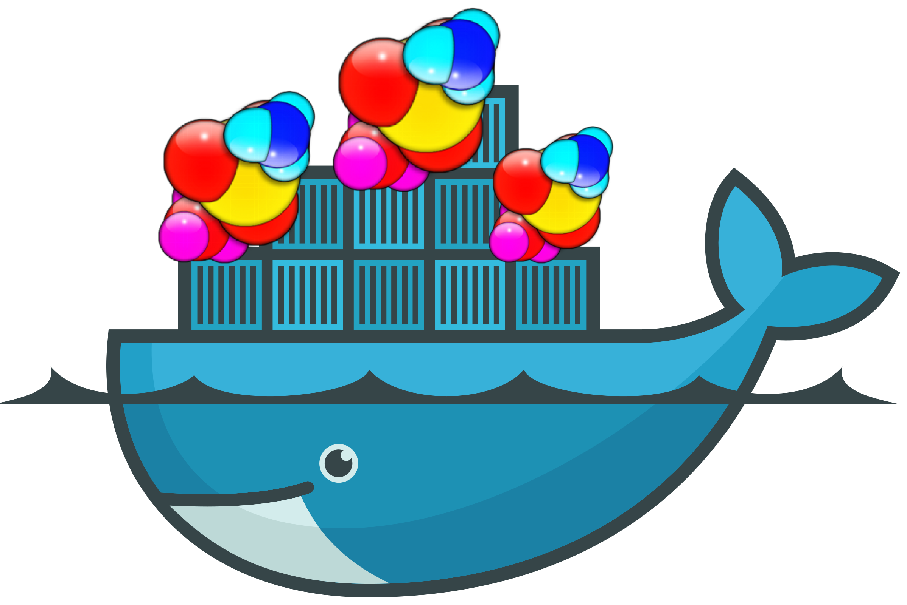
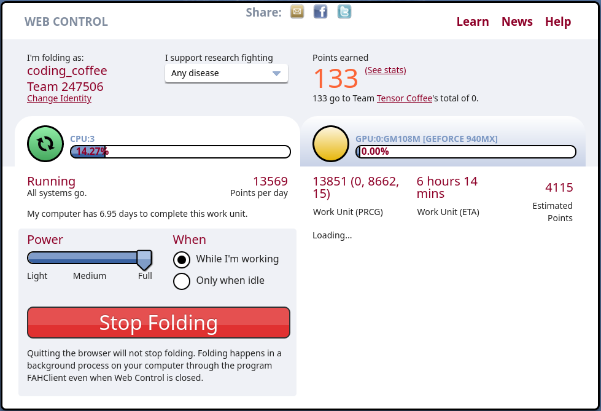

<div align="center">
  
  <h1>
    Dockerized FAHClient
  </h1>
</div>

---

[](https://github.com/codingcoffee/fahclient/blob/master/LICENSE)
[](https://hub.docker.com/r/codingcoffee/fahclient)
[](https://hub.docker.com/r/codingcoffee/fahclient/tags?name=latest)
[](https://github.com/codingCoffee/fahclient/actions?query=workflow%3A%22Docker+Image+CI%22)

[Folding@home (FAH or F@h)](https://foldingathome.org) is a distributed computing project for simulating protein dynamics, including the process of protein folding and the movements of proteins implicated in a variety of diseases. It brings together citizen scientists who volunteer to run simulations of protein dynamics on their personal computers. Insights from this data are helping scientists to better understand biology, and providing new opportunities for developing therapeutics.

## Usage

- CPU only

```sh
docker run -it --rm -d \
  --name fahclient \
  -p 7396:7396 \
  codingcoffee/fahclient \
  --allow 0/0  \
  --web-allow 0/0
```

- CPU and GPU

```sh
docker run -it --rm -d \
  --name fahclient \
  --gpus all \
  -p 7396:7396 \
  -e ENABLE_GPU=true \
  codingcoffee/fahclient \
  --allow 0/0  \
  --web-allow 0/0
```

You can also visit the web dashboard by visiting http://localhost:7396 in your browser.



## GPU Support

Since this image uses [nvidia/cuda](https://hub.docker.com/r/nvidia/cuda) as it's base image, to use the GPU support, you'll need to have an NVIDIA GPU, and [NVIDIA Container Toolkit](https://github.com/NVIDIA/nvidia-docker) installed on your system.

## List of usable environment variables

| Environment Varible | Value                   | Default     |
| ------------------- | ----------------------- | ----------- |
| `USER`              | your username           | `Anonumous` |
| `TEAM`              | your team name          | `0`         |
| `PASSKEY`           | your passkey            |             |
| `ENABLE_GPU`        | `true`/`false`          | `false`     |
| `ENABLE_SMP`        | `true`/`false`          | `true`      |
| `POWER`             | `full`/`medium`/`light` | `full`      |

## FAQ

Q: How can I use this with Docker Compose?

A: Well, you can use it with docker compose if you don't want the GPU support. This is because docker compose still doesn't have the a way to specify the `--gpu` flag, or atleast I wasn't able to figure it out. If you did, open a issue / send a PR with the `docker-compose.yml` file.

## Logs

To get the logs of the running container

```sh
docker logs -f fahclient
```

## Build

To build the image locally

```sh
docker build -t codingcoffee/fahclient .
```

## Contribution

Have better suggestions to optimize the image? Found some typos? Go ahead and send in a Pull Request! Contributions of any kind welcome!

## LICENSE

The code in this repository has been released under the [GNU General Public License v3](https://github.com/codingcoffee/fahclient/blob/master/LICENSE)

